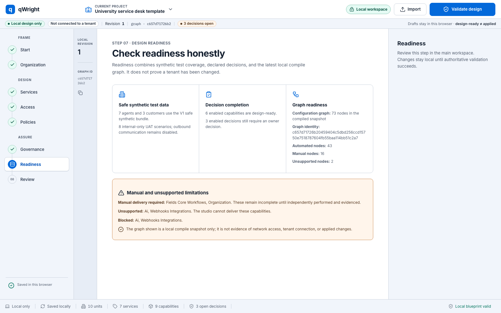
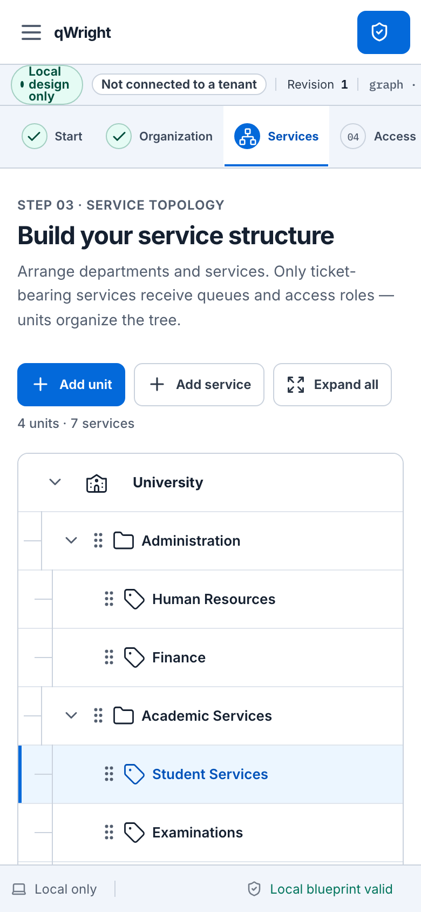

# Queuewright

Queuewright validates local JSON descriptions of Zammad configuration and
compiles them into deterministic symbolic plans. Queuewright Studio provides a
browser interface for editing the same configuration model through a
loopback-only Python service.

Queuewright does not connect to Zammad, read credentials, inspect a tenant, or
apply configuration. Plans, graphs, and `ready` states are local design
artifacts.

## Static demo

Explore the [Queuewright Studio static demo](https://sebastianspicker.github.io/queuewright/).
It uses the real Studio interface and bundled fictional university fixture.
Every command-capable action is marked as simulated. The demo does not call the
loopback compiler, validate a configuration, create exports, persist changes,
or connect to a tenant.

Version `0.1.0-alpha.1` is an unpublished source-release candidate. File
formats and Studio workflows may change before `1.0.0`.

## Scope

Implemented:

- validation for profile and desired-state schema versions `1.0` and `1.1`;
- deterministic, dependency-ordered symbolic plans;
- V1 Studio projects and migration to Blueprint V2;
- capability and resource graph compilation;
- local browser editing for organization, service structure, access, policies,
  governance, readiness, and exports;
- a minimal example and a fictional university template;
- an experimental connected-control package tested through injected
  transports.

Not implemented:

- live tenant discovery;
- a Zammad HTTP adapter;
- tenant changes or rollback commands exposed to users;
- credential storage or environment-based connection discovery;
- a hosted operational application, Python package, container image, or
  deployment manifest;
- compatibility guarantees before `1.0.0`.

The connected-control package is not imported by the CLI or Studio. See
[Connected mode](docs/CONNECTED_MODE.md) for its current boundary.

## Requirements

| Component | Requirement |
|---|---|
| Offline CLI | Python 3.11 or newer |
| Studio service | Python 3.11 or newer |
| Full Python test suite | Python 3.11 or newer and `cryptography==49.0.0` |
| Studio frontend | Node.js 22.12 or newer and npm 10 or newer |
| Browser tests and screenshots | Playwright Chromium |

The offline CLI and Studio service use the Python standard library. The pinned
`cryptography` dependency is used only by `queuewright_control` and its tests.

## Installation

Queuewright runs from a source checkout. Its `pyproject.toml` provides project
metadata and Ruff configuration; there is no wheel or installed console command.

For the offline CLI and Studio service, run commands from the repository root.
No Python dependency installation is required.

To run the complete Python test suite:

```bash
python3 -m venv .venv
.venv/bin/python -m pip install --requirement requirements-control.txt
```

Install the frontend dependencies from the lockfile:

```bash
cd studio-ui
npm ci
```

## Configuration

Queuewright reads explicit JSON files:

| Path | Purpose |
|---|---|
| [`profiles/example/`](profiles/example/) | Minimal profile and desired-state example |
| [`studio/templates/university/`](studio/templates/university/) | Fictional university starter |
| [`studio/catalog/`](studio/catalog/) | Studio feature and capability registries |
| [`schemas/`](schemas/) | JSON Schemas for profiles, desired state, Studio projects, and the future connection contract |

The Python validator is authoritative for cross-file references and safety
rules that JSON Schema does not express. Configuration must remain
`offline_only`, use dummy-mode email templates under `example.invalid`, reject
URLs and credential-shaped settings, and disable existing-object writes and
deletion. Names and labels require manual review to confirm that they are
fictional.

The CLI and Studio service do not read environment variables. The screenshot
script accepts one optional variable:

| Variable | Default | Purpose |
|---|---|---|
| `STUDIO_URL` | `http://127.0.0.1:5173` | Browser URL used by `scripts/capture_studio_screenshots.mjs` |

See [Reusable configuration](docs/REUSABLE_CONFIGURATION.md) for a profile
overview and the customization procedure.

## CLI usage

Validate a profile:

```bash
python3 -m queuewright validate profiles/example/profile.json
```

Compile a symbolic plan to standard output:

```bash
python3 -m queuewright plan profiles/example/profile.json
```

Write a plan to a new JSON file:

```bash
python3 -m queuewright plan profiles/example/profile.json \
  --output /tmp/example-plan.json
```

The output path must end in `.json`. Queuewright refuses sensitive paths,
input-file overwrite, and overwrite of an existing output file.

Validate both bundled configurations:

```bash
python3 -m queuewright self-test
```

Use `python3 -m queuewright --help` for the complete command list.

## Queuewright Studio

Studio uses two fixed loopback ports. Start the Python service from the
repository root:

```bash
python3 -m queuewright_studio
```

Start Vite in another terminal:

```bash
cd studio-ui
npm run dev
```

Open `http://127.0.0.1:5173`.

The browser sends `/api/v1` and `/api/v2` requests through the Vite proxy to
`127.0.0.1:8765`. The Python service accepts JSON request bodies up to 2 MiB
and exposes health, catalog, import, V1 compile, V2 migration, and V2 compile
routes. Both servers use strict ports and do not select alternatives.

Studio stores V1 and V2 drafts in IndexedDB for the
`http://127.0.0.1:5173` origin. The current interface has no delete-all
control. Clear site data in the browser to remove drafts.

See [Studio](docs/STUDIO.md) for the project formats, endpoints, and export
rules.

## Screenshots

The repository contains two current UI captures made with fictional data:





The captures document the interface. They do not prove browser compatibility,
accessibility conformance, or tenant interaction. See
[Screenshot maintenance](docs/screenshots/README.md).

## Repository structure

| Path | Purpose |
|---|---|
| `queuewright/` | Profile loader, validator, compiler, Blueprint support, and CLI |
| `queuewright_studio/` | Loopback JSON service used by Studio |
| `studio-ui/` | React, TypeScript, Vite, Vitest, and Playwright frontend |
| `queuewright_control/` | Experimental connected-control primitives |
| `profiles/` | Reusable profile bundles |
| `studio/catalog/` | Feature and capability registries |
| `studio/templates/` | Studio starter bundles |
| `schemas/` | JSON Schema documents |
| `tests/` | Python unit and boundary tests |
| `scripts/verify_repo.py` | Repository and documentation checks |
| `scripts/verify_git_ignores.sh` | Git-native private and publishable path checks |
| `scripts/capture_studio_screenshots.mjs` | Playwright screenshot capture |
| `docs/` | Configuration, Studio, security-boundary, and release documentation |

## Development workflow

1. Keep profile policy in JSON unless a rule is a repository-wide invariant.
2. Preserve the offline boundary in `queuewright` and `queuewright_studio`.
3. Add or update tests for contract changes.
4. Run the focused test first, then the complete applicable gate.
5. Update documentation when commands, paths, schemas, or runtime behavior
   change.

No Python linter, formatter, or static type checker is configured. TypeScript
checking runs as part of `npm run build`.

See [Contributing](CONTRIBUTING.md) for pull-request requirements.

## Testing

Run the Python checks from the repository root:

```bash
python3 -m queuewright self-test
python3 -m unittest discover -s tests -v
python3 scripts/verify_repo.py
bash scripts/verify_git_ignores.sh
```

Run the frontend checks from `studio-ui/` after `npm ci`:

```bash
npm run test
npm run build
npm run test:e2e
```

Active tests use the framework-standard locations:

| Path | Scope |
|---|---|
| `tests/test_queuewright.py` | Offline profile, compiler, CLI, and safety contracts |
| `tests/test_queuewright_blueprint.py` | Blueprint migration and graph contracts |
| `tests/test_queuewright_studio.py` | Studio dispatch and HTTP boundary contracts |
| `tests/test_queuewright_control.py` | Experimental connected-control contracts, active in CI |
| `studio-ui/src/*.test.tsx` and `studio-ui/src/*.test.ts` | Vitest component, API, and model tests |
| `studio-ui/e2e/*.spec.ts` | Playwright browser tests |

CI uses Python 3.11 and Node.js 22. It installs Chromium before running the
Playwright suite.

Current release-gate results and unresolved checks are recorded in
[Release status](RELEASE_STATUS.md).

## Operation and deployment

Queuewright supports local source-checkout operation only. The repository does
not contain a production server, container definition, service unit, hosted
deployment configuration, or package publication workflow.

Do not expose ports `5173` or `8765` on a network interface. The service
constructor rejects non-loopback binding, and Vite is configured for
`127.0.0.1`.

## Troubleshooting

### Port 5173 or 8765 is already in use

Stop the conflicting process. Studio and its browser tests require both fixed
ports.

### The browser reports that the compiler is unavailable

Start `python3 -m queuewright_studio` from the repository root and confirm that
`http://127.0.0.1:8765/api/v1/health` is reachable from the same host.

### Exports remain disabled

Resolve the validation error and run validation again. Downloads are enabled
only after both the V1 plan and V2 graph compile for the current project
revision.

### `npm ci` fails

Use the checked-in `studio-ui/package-lock.json`, a compatible Node.js and npm
version, and the configured registry. Do not replace the lockfile with an
unreviewed dependency graph.

### A plan output already exists

Choose a new output path or remove the old file after reviewing it. Queuewright
does not overwrite plan files.

## Security considerations

- Do not place credentials, tenant URLs, customer data, or live snapshots in
  profiles or Studio projects.
- Keep `.local/`, environment files, key material, browser state, and exports
  out of version control.
- Use fictional `example.invalid` identities in reusable configurations.
- Treat plans and `ready` states as local review artifacts, not authorization
  to change a tenant.
- Use a dedicated browser profile if Studio data must be isolated from other
  local browsing.

See [Security policy](SECURITY.md) for reporting and storage guidance.

## Contributing

Read [CONTRIBUTING.md](CONTRIBUTING.md) before submitting changes. Release
procedures are documented in [RELEASING.md](RELEASING.md). The project is
licensed under the [MIT License](LICENSE).
