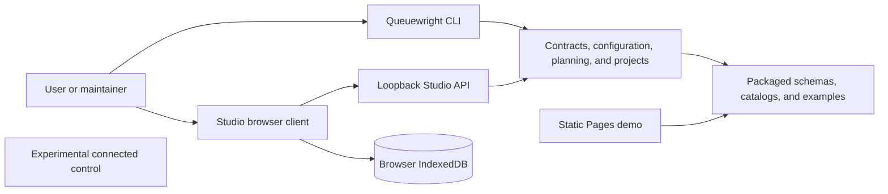
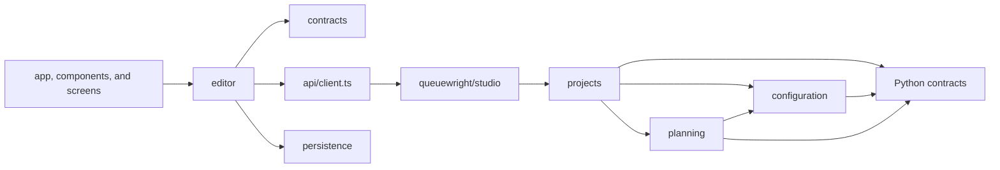

# Architecture

Queuewright is a modular monolith for offline Zammad configuration design. The
active Python distribution validates local JSON bundles, creates deterministic
review artifacts, and provides a bounded loopback API for Queuewright Studio.
It contains no tenant client, credential loader, or apply path.

## System context



The CLI, core layers, and loopback API ship in the active Python distribution.
The React client is a private Node package that is developed and built
independently. The static Pages demo runs the same client with bundled data but
has no API or persistence. Connected control is separately packaged
experimental code and has no import edge to the active product.

## Repository components

| Component | Responsibility | Boundary |
| --- | --- | --- |
| `queuewright/` (`__init__`, `cli.py`, `errors.py`) | Public Python API, command line, and `ConfigurationError` | `queuewright.__all__` is the Python API |
| `queuewright/contracts/` | `json` (canonical JSON), `paths` (packaged catalogs), `safety` (safe-JSON rules), `schemas/`, and `catalogs/` | Lowest active layer |
| `queuewright/configuration/` | `loading`, `rules`, `validation`, `resources`, `automation`, `object_manager`, and `uat` for profile and desired-state validation | Reads explicit local bundles |
| `queuewright/planning/` | `compiler` (symbolic plans) and `inventory` | Produces inert review artifacts |
| `queuewright/projects/` | `bundle` (version-independent bundle fields, header checks, and bundle validation), `v1` (V1 project model and artifacts), `v2` (Blueprint V2 and migration), `graph` (project compilation), `ownership`, `state`, `registry`, and `errors` | Pure domain logic; raises `ProjectError` and knows nothing of HTTP |
| `queuewright/studio/` | `routes` (`StudioService` route table, error envelopes, and status mapping), `server` (loopback HTTP transport), `input`, and `representation` | Fixed loopback transport with in-memory service state |
| `queuewright/examples/` | Packaged fictional profiles and projects, and `example_path` | Package data |
| `queuewright_studio/` | Module-entry shim: `python -m queuewright_studio` delegates to `queuewright studio`; re-exports `StudioService` and `create_server` | Compatibility only; see below |
| `studio-ui/` | React client: `api`, `app`, `components`, `contracts`, `data`, `editor` (`editor/model` is the model surface), `persistence`, `screens`, and `styles` | Private Node package |
| `experimental/connected_control/` | Connection, credential, evidence, recovery, ledger, and dispatcher primitives | Separate Python package and test suite |

## Dependency direction

The active Python layers depend only on themselves or layers to their left:

```text
contracts <- configuration <- planning <- projects <- studio
```

`studio` may use `contracts` and `projects` directly. `projects` may use
`configuration`, `planning`, and `contracts`. A module must not import an
underscore-prefixed name from a different subpackage; private names are shared
only inside their own subpackage.

Error and status ownership follows the same direction. `projects` raises
`ProjectError` (a `ConfigurationError`) with a path and kind. Only
`queuewright/studio/routes.py` maps those errors to HTTP status codes and
error envelopes; `queuewright/studio/server.py` owns transport concerns such as
`Host` and `Origin` checks, body limits, and headers.

Packaged registries (feature catalog and capabilities) are loaded once by
`queuewright/projects/registry.py` and shared. A corrupt packaged registry
raises `ConfigurationError` ("feature registry ..."). There is no
custom feature-catalog injection.

The browser uses a similarly narrow set of seams:



`studio-ui/src/api/client.ts` is the only browser fetch surface.
`studio-ui/src/persistence/` is the only browser-storage surface.
`scripts/check_architecture.py` enforces both the Python direction and these
frontend seams. It also rejects imports between the active product and
connected control.

## Principal data flows

### Profile validation and planning

1. The CLI receives an explicit profile path.
2. Configuration loading resolves the profile's relative desired-state
   manifest while rejecting escaping or sensitive paths.
3. JSON schemas validate portable shape; Python validation enforces
   cross-document references and safety rules.
4. Planning compiles the validated bundle into ordered symbolic operations.
5. The CLI prints canonical JSON or atomically creates a new JSON output file.

The compiler does not execute the operations it describes.

### Studio editing

1. Vite serves the browser client on `127.0.0.1:5173` and proxies API paths
   to `127.0.0.1:8765`.
2. The client loads the feature catalog and sends raw bundles, V1 projects, or
   authored V2 drafts through its single API client.
3. `StudioService` validates the input through `queuewright.projects`,
   migrates V1 when needed, and returns a server-normalized canonical V2
   project plus local plan and graph artifacts.
4. The editor keeps transient state in React and persists canonical V2 drafts
   to IndexedDB. The API does not persist projects.

Blueprint V2 is the authoritative editable bundle. V1 is accepted as a
compatibility input and migrated before persistence. Compiler-owned workbook
sections are normalized projections, not a second authored source of truth.

## Configuration and state ownership

The active runtime reads no environment-based tenant configuration and has no
configuration-precedence stack. Profiles and manifests are explicit local JSON
inputs. Packaged catalogs and schemas define shared contracts. The only
environment switch is build-time `VITE_STATIC_DEMO=true`, used by the demo
build.

Server-side Studio state is in memory. Browser drafts belong to the local
IndexedDB origin. No database, migration service, backup process, hosted
runtime, metrics, authentication, or TLS termination is defined for the active
product.

## Safety and compatibility invariants

- Active code performs no outbound networking and accepts no tenant
  credentials.
- Studio binds only to loopback, validates `Host` and `Origin`, accepts exact
  JSON requests up to 2 MiB, and sends `Cache-Control: no-store`.
- Offline project completion may be `decision_required`, `ready`, or
  `blocked`; `applied` and `verified` require unavailable external evidence.
- Bundled examples are fictional and use `example.invalid` identities.
- V1 import and migration remain compatibility contracts while V2 is
  canonical.
- `queuewright.__all__` is the Python API. The `queuewright_studio` shim
  exists only for the documented `python -m queuewright_studio` module entry
  and is removed at the first tagged release.
- Connected-control primitives remain isolated and are not evidence of a live
  Zammad integration.

## Build and deployment boundaries

`bash scripts/verify` validates the active Python package (including real-HTTP
Studio tests), Studio client, and package archives. Connected control is installed and tested in a separate CI
job. The only deployment workflow builds `studio-ui` with
`VITE_STATIC_DEMO=true` and publishes `studio-ui/dist` to GitHub Pages. It
does not deploy the Python API or a tenant-connected service.

There is no plugin system. Supported customization is through validated local
profiles, desired-state manifests, and safe Blueprint V2 extension data.

The governing architectural decision is recorded in
[ADR 0001](adr/0001-modular-monolith-and-isolated-control.md).
