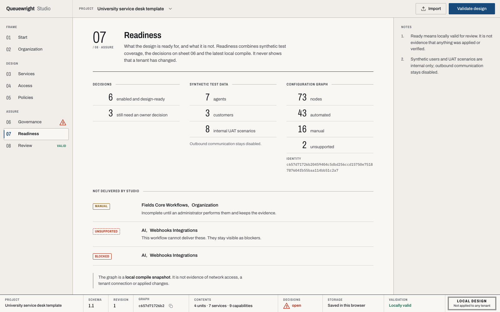
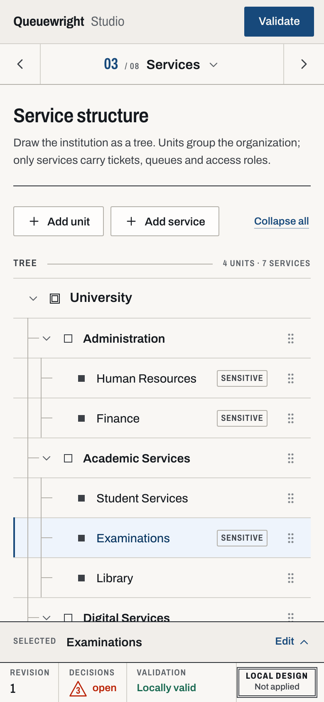

# Queuewright Studio

Queuewright Studio is the local browser editor for Queuewright projects. It has
no tenant URL field, credential input, discovery request, or apply operation.

## Local runtime

```text
browser at 127.0.0.1:5173
  -> Vite proxy for /api/v1 and /api/v2
  -> Queuewright API at 127.0.0.1:8765
```

From the repository root, install the Python and Node development dependencies,
then start the two processes in separate terminals:

```bash
python3 -m pip install '.[dev]'
npm --prefix studio-ui ci
python3 -m queuewright studio
```

```bash
npm --prefix studio-ui run dev
```

Open `http://127.0.0.1:5173`. Stop either process with `Ctrl-C`. Both ports
are fixed and must be available. `http://127.0.0.1:5173` is the only allowed
development `Origin`.

The API validates loopback `Host` and `Origin`, accepts exact
`application/json` request bodies up to 2 MiB and 64 container nesting levels, and returns
`Cache-Control: no-store`. It provides no authentication, TLS, request log,
metrics, or hosted-service configuration because it is a local development
service.

Use `GET http://127.0.0.1:8765/api/v1/health` to check the API process.

## HTTP interface

| Method | Path | Purpose |
| --- | --- | --- |
| `GET` | `/api/v1/health` | Report local service health |
| `GET` | `/api/v1/catalog` | Return the feature catalog |
| `POST` | `/api/v1/import-bundle` | Validate a profile and manifest and create a V1 project |
| `POST` | `/api/v1/compile-project` | Compile a V1 project and compatibility artifacts |
| `POST` | `/api/v2/migrate-project` | Convert a V1 project to Blueprint V2 |
| `POST` | `/api/v2/compile-project` | Compile a V2 project through the legacy V2 route |
| `POST` | `/api/v2/compile` | Normalize a raw bundle, V1 project, or authored V2 draft and compile canonical V2 |
| `POST` | `/api/v2/compile-editor` | Return the same compilation with duplicate transport values omitted |

The browser calls `GET /api/v1/catalog` and `POST /api/v2/compile-editor` through
`studio-ui/src/api/client.ts`. The other routes remain compatibility and
inspection surfaces.

The editor response uses `representation: "editor-1"`. Its bundle is present
only at `project.bundle`. Graph operation nodes omit `desired`; the client
restores it from the plan operation with the same `id`. Capability nodes retain
their own `desired` values. Hashes refer to the complete canonical artifacts,
and the client restores those artifacts before presenting or exporting them.
The packaged `queuewright-editor-compile.schema.json` describes this response.
Invalid JSON and parser numeric or nesting limits return a structured HTTP 400
`invalid_json` error.

## Workflow and project formats

The interface moves through Start, Organization, Services, Access, Policies,
Governance, Readiness, and Review. Capability status records design and review
state; it does not imply API support or tenant execution.

Blueprint V2 is the authoritative editable bundle. It contains project
metadata, the validated V1-compatible bundle, authored organization data,
capability decisions, and extensions. Compiler-owned services, policies, UAT,
and catalog metadata are regenerated projections and must not be edited as a
second source of truth.

Studio accepts a raw profile and manifest, a V1 project, or a Blueprint V2
document. V1 is validated and migrated before the editor persists it. Local
completion may be `decision_required`, `ready`, or `blocked`. The validator
rejects `applied` and `verified` because the active product cannot produce
external evidence.

## Browser state

Drafts are unencrypted local records in the `queuewright-studio` IndexedDB
database for the `127.0.0.1:5173` origin. The `projects` store is authoritative;
a draft and its active selection are saved in one transaction. Database version
4 copies missing legacy `blueprints` records into `projects` without replacing
existing records, and retains the legacy store for recovery.

The active draft is validated and opened before background migrations run.
At most two V1 migrations run concurrently; only successful V1 migrations are
rewritten, without changing the active selection or overwriting intervening
edits. Invalid records remain preserved for recovery, and a failed active draft
opens a seed with a different ID. V2 library records are validated when opened.
The interface has no delete-all control; clear the site's browser data to remove
drafts.

Do not place credentials, tenant URLs, customer data, or approval evidence in
projects or drafts.

## Compatibility surface

`python3 -m queuewright_studio` delegates to `python3 -m queuewright studio`
and rejects unknown arguments; the `queuewright_studio` package re-exports
`StudioService` and `create_server` for that entry only and is removed at the
first tagged release. New code should import from `queuewright.studio` or run
`python3 -m queuewright studio`.

The V1 and legacy V2 HTTP routes remain supported compatibility surfaces.
Blueprint V2 and `POST /api/v2/compile` are the canonical application path.

## Static demo

`npm --prefix studio-ui run build:demo` sets `VITE_STATIC_DEMO=true` and
builds the client for the `/queuewright/` Pages base path. The demo uses
bundled fictional data, simulates command-capable actions, and has no API or
browser persistence. The Pages workflow deploys only `studio-ui/dist`.

## Interface conventions

- Use Queuewright for the product and Queuewright Studio for the browser
  application.
- `ready` means locally valid for review, not applied or externally verified.
- Use text and structure in addition to color for status.
- Preserve visible keyboard focus and reduced-motion behavior.

WCAG conformance, cross-browser behavior, and responsive layout remain manual
release checks.

## Screenshots





These images contain bundled fictional data and document visible states; they
are not browser-test evidence. Before replacing them, run the Studio builds,
review desktop and mobile clipping and labels, confirm that no private or
unrelated desktop content is visible, and run
`python3 -B scripts/verify_repo.py`.

## Verification

```bash
npm --prefix studio-ui run typecheck
npm --prefix studio-ui run test
npm --prefix studio-ui run build
npm --prefix studio-ui run build:demo
```

Real-HTTP API behavior is covered by `StudioHTTPTests` in
`tests/test_queuewright_studio.py`, which replaced the former smoke script. The
complete active gate is `bash scripts/verify`.
